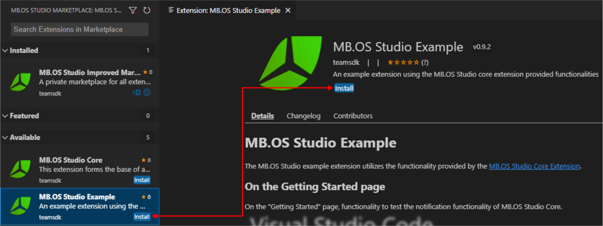

# MB.OS Studio Marketplace


The MB.OS Studio Marketplace provides the functionality of an Mercedes-Benz internal extension marketplace
and allows users to quickly find extensions published by Mercedes-Benz developers within the company.
Instead of going through the process of making projects/extensions open-source and release the extension
on the official Microsoft Visual Studio Code Marketplace, the internal marketplace allows users to quickly
publish extensions and make them available to all developers at Mercedes-Benz.

## Installing the MB.OS Studio Marketplace extension

- Visit the MB.OS Studio section on the [MB.OS Documentation Portal](https://docs.mbos.mercedes-benz.com/develop/mbos-studio/)
- Follow the installation guide or  
  \- Download the extension package (VSIX-File)  
  \- Open the command palette (Ctrl-P on Windows) and select  
    `Extensions: Install from VSIX...`
    

## Using the MB.OS Studio Marketplace extension

After the installation of the MB.OS Studio Marketplace extension, a new icon will appear in the sidebar.
Selecting this icon will open the MB.OS Studio Marketplace and after the successful login, you are able
to browse all available extensions.

 

### Filtering/Searching for extensions

Scroll down the list to find the required extension or type some text into the search bar which will
filter the list of extensions. Alternatively, the filter submenu can be used to filter extensions by
state.


### Reading the details of an extension

If you would like to see more detail of an extension, just select the extension in the list.
It will open a window containing additional information.


### Installing, uninstalling or updating extensions

To install extensions just hit the `Install` button within the extension list or within the extension
detail view. You can also use the VSCode default extension view (Ctrl + Shift + X) and uninstall the
extension from there.



If there is an update of an extension available, it will be visible within the extension list and
within the detailed view of an extension. Just hit `Update to x.y.z` to update your extension to the
selected version.


### Enrolling for extension pre-releases

The extension list and detail view will only show released versions as default. In case you would
like to test pre-release/beta versions of extensions, you need to explicitly enable this feature.

As of today, all extensions are published directly in Release.
This is because we currently have no way to authorize the publisher, which we want to change soon.
So for the beginning the only way to get into Pre-Release is
to [Contact Support](mailto:f10ce30a.corpdir.onmicrosoft.com@emea.teams.ms) and they do it manually.

## Uninstalling the MB.OS Studio Marketplace

If you want to remove the MB.OS Studio Marketplace from your Visual Studio Code installation, just
open the default extensions view (Ctrl + Shift + X), search for `MB.OS Studio Marketplace` and
remove the extension as usual.


## Publishing your own extensions in the marketplace

### Getting permissions and registering publisher

To get permissions and register a new publisher,
please [Contact Support](mailto:f10ce30a.corpdir.onmicrosoft.com@emea.teams.ms) first.

### Special handling of images

To make sure images appear in the extension, please consider the following points:

- Path to the image file should be relative
- The image should actually exist in the given path
- Path should not be ignored in `.vscodeignore` file
- Add the `--no-rewrite-relative-links` option to vsce package to skip rewriting relative links

```json
{
  ...
  "icon": "resource/icon.png",
  "scripts": {
    ...
    "package": "npx vsce package -o extensionName.vsix --no-rewrite-relative-links",
    "prepack": "npm run package" 
    ...
  }
  ...
}
```

### Publishing your own extensions via service

Requirement:

- Extension is packaged into the installable VSIX format
- Get a GAS-OIDC token. Please refer to these two resources:  
  \- <https://pages.git.daimler.com/IAM/GAS-OIDC-Integration_Guide/>  
  \- <https://team.sp.wp.corpintra.net/sites/05389/SitePages/IAMServices.aspx>

Note:
The following screenshots in the described steps are demonstrated on the API platform Postman.
Feel free to use any other tool you like to achieve the same result.

Steps:

1. Set the baseUrl to <https://hljvy7vkn4.execute-api.eu-central-1.amazonaws.com/Live>
  

2. Postman specific:
  Import the api.yaml file found in `packages/mbosstudio-marketplace-api/api`

3. Get a GAS-OIDC access token via your GAS-OIDC client id, add it as the value of "token" in
  the body of the POST request `{baseUrl}/auth:exchange` and send it.
  You should get back a marketplace token as a response.
  Note that this token will expire in a few minutes.
  

4. Make sure the HTTP requests in the following steps will use the session token as Bearer token.  
  Postman specific:  
  Click on the “MB.OS Studio Marketplace API” collection, select the “Authorization” tab,
  set the Type to “Bearer Token” and add the token in the input field “Token”
  
  To use this token in the following requests, have their authorization set to “Inherit auth from parent”.
  

5. Next we need a signed URL to upload your extension to.
  Send the GET request `{baseUrl}/extensions:get-storage` [token required].
  It should return a signed URL and a key.
  

6. Use the URL from the previous step to create a new PUT request [token required].
  Set the body of this request to a binary type, attach your extension and send the request.
  

7. If you get 200 as a response, use the key from the previous
  GET request "Provide url to extension storage" service response,
  set it in the body of the POST request `{baseUrl}/extensions:import` [token required] and send it.
  If your extension successfully passes our pre-flight checks you should receive
  a "Extension package was added to the database and uploaded to the cloud." response.
  Otherwise you get detailed hints about the failed pre-flight checks
  which you should solve before uploading again.
  
